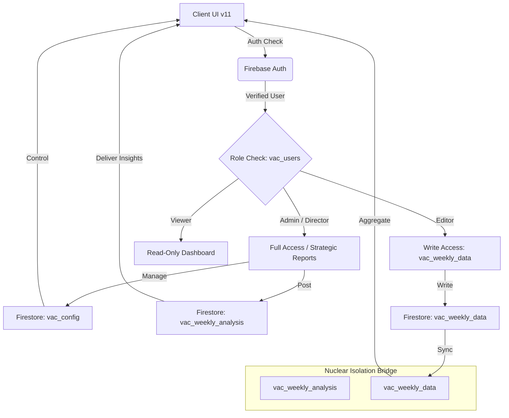

# IPS Análisis Estratégico de Vacantes

Sistema ejecutivo de alto rendimiento para el monitoreo estratégico de la plantilla de estado de fuerza (EdoFza), altas, bajas y vacantes. Diseñado bajo estándares de **Inteligencia de Negocio Premium**.

## 🛡️ Nuclear Isolation Architecture (v11.0.2)

Esta aplicación implementa la arquitectura **Nuclear Isolation**, un sistema riguroso de aislamiento de datos ("Air Gap" lógico) que garantiza la independencia total de la información de Vacantes.

### 🔐 El Escudo `vac_`
Todas las colecciones en Firestore y la lógica del sistema están acopladas al namespace `vac_` ("Vacantes"):
*   `vac_users`: Gestión de roles (Admin, Director, Editor, Viewer).
*   `vac_weekly_data`: Captura operativa semanal por Unidad Estratégica.
*   `vac_weekly_analysis`: Informes estratégicos cualitativos de León Prior.
*   `vac_config`: Parámetros globales y sincronización de periodos.
*   `vac_unes`: Catálogo maestro de Unidades Estratégicas.

**Cualquier acceso a colecciones sin el prefijo `vac_` provoca un bloqueo inmediato (Hard Lock) en el pipeline de build.**

## 📊 Data Flow & Security Bridge

## 💻 Technical Stack

-   **Frontend**: React 18 (Hooks) + TypeScript
-   **Styling**: Premium Vanilla CSS (Mobile-First 44px)
-   **Intelligence**: Cloud Firestore (Namespace: `vac_`)
-   **Build Guard**: `scripts/check-config.js` (Audit v11)

## 📊 Feature Highlights
-   **Executive Intelligence Pulse**: Notificación visual de reportes listos.
-   **Robust Local Sorting**: Datos siempre visibles sin dependencia de índices externos.
-   **National Bridge**: Blindaje del ID `NATIONAL_DATA` para métricas críticas.
-   **UX Excellence**: Adaptación total a dispositivos iOS y Android (Regla UX001).

## 🛠️ Setup & Deployment

1.  **Instalación**: `npm install`
2.  **Desarrollo**: `npm run dev`
3.  **Auditoría de Seguridad**: `npm run prebuild`
4.  **Despliegue**: `npm run firebase-deploy`

---
*Arquitectura diseñada por León Prior para el Blindaje Estratégico de Información.*
